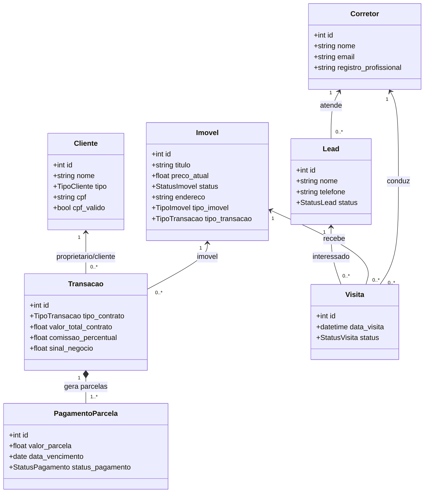

# 🏠 Sistema Imobiliário - Guia de Implementação e Uso

## ✅ O que foi implementado

### 1. **Upload de Fotos dos Imóveis**
- Endpoint: `POST /api/v1/imoveis/upload-foto`
- Armazenamento local em `static/fotos_imoveis/`
- Validação: JPEG, PNG, GIF, WebP (máx 5 MB)
- Retorna URL relativa para usar ao criar imóvel

### 2. **Validação de CPF com Algoritmo Oficial**
- Biblioteca: `brutils[cpf]`
- Valida dígitos verificadores (módulo 11)
- Auto-normaliza CPF (remove caracteres especiais)
- Campo obrigatório para Pessoa Física, opcional para PJ
- Garante unicidade de CPF no BD

### 3. **Integração com BrasilAPI para CEP**
- Endpoint: `https://brasilapi.com.br/api/cep/v1/{cep}`
- Auto-popula campos: `logradouro`, `bairro`, `cidade`, `uf`
- Cache em memória para 60 minutos (reduz chamadas)
- Trata CEPs inválidos gracefully
- Permite override manual de dados

### 4. **Tela Inicial Pública - Catálogo de Imóveis**
- URL: `http://localhost:8000/catalogo` (sem login necessário)
- Redireciona `/` para `/catalogo` se não autenticado
- Design responsivo com NiceGUI

#### Filtros Implementados:
- **Bairro**: Dropdown com bairros únicos do BD
- **Tipo de Transação**: VENDA, ALUGUEL, Ambos
- **Tipo de Imóvel**: Apartamento, Casa, Comercial, Terreno, Cobertura, Kitinete
- **Faixa de Preço**: Slider com valor mín/máx
- **Resultados ordenados** por imóvel mais recente

#### Funcionalidades:
- Grid de cards com foto, título, preço, bairro
- Modal de detalhes com descrição completa
- Formulário "Entrar em Contato" (cria cliente e lead)
- Placeholder automático se sem foto
- Filtros em tempo real

### 5. **Auto-Cadastro Inteligente de Clientes**
- `POST /api/v1/clientes/` com validação de CPF e busca de CEP
- Validação de CPF se Pessoa Física
- Auto-preenchimento de endereço via BrasilAPI
- Prevents duplicação de CPF

### 6. **Novos Campos nos Modelos**

#### Imovel:
- `foto_url` (String, nullable) - Caminho relativo da foto
- `bairro` (String, nullable) - Para filtros
- `tipo_imovel` (TipoImovel, nullable) - Categorização
- `tipo_transacao` (TipoTransacao, nullable) - VENDA ou ALUGUEL

#### Cliente:
- `cpf` (String, unique, nullable) - Validado com brutils
- `cpf_valido` (Boolean) - Flag de validação bem-sucedida
- `bairro`, `cidade`, `uf`, `logradouro` - Auto-preenchidos

---

## 🚀 Como Usar

### 1. Instalar Dependências
```bash
pip install -r requirements.txt
```

### 2. Iniciar o Servidor FastAPI
```bash
uvicorn main.py --reload
```
O servidor rodará em `http://localhost:8000`

### 3. Acessar o Catálogo Público
```
http://localhost:8000/catalogo
```

### 4. Acessar o Admin (com autenticação)
```
http://localhost:8000/login
```
Ou em `http://localhost:8080` se usar `frontend.py`:
```bash
python frontend.py
```

---

## 📋 Workflow de Cadastro de Imóvel

### 1. Fazer Upload de Foto
```bash
POST /api/v1/imoveis/upload-foto
Content-Type: multipart/form-data

file: <binary>
```

**Resposta:**
```json
{
  "foto_url": "fotos_imoveis/abc123def456.png",
  "filename": "abc123def456.png"
}
```

### 2. Criar Imóvel
```bash
POST /api/v1/imoveis/
Content-Type: application/json

{
  "titulo": "Apartamento 3 quartos no Centro",
  "descricao": "Imóvel com vista para o parque...",
  "preco_atual": 450000.00,
  "status": "DISPONIVEL",
  "endereco": "Rua Principal, 123, São José do Rio Preto",
  "foto_url": "fotos_imoveis/abc123def456.png",
  "bairro": "Centro",
  "tipo_imovel": "APARTAMENTO",
  "tipo_transacao": "VENDA"
}
```

---

## 📋 Workflow de Cadastro de Cliente

### Opção 1: Com CPF e CEP (Recomendado)
```bash
POST /api/v1/clientes/
Content-Type: application/json

{
  "nome": "João Silva",
  "contato": "joao@email.com",
  "tipo": "FISICA",
  "cpf": "11144477735",
  "cep": "01310100"
}
```

**Resposta:**
```json
{
  "id": 1,
  "nome": "João Silva",
  "contato": "joao@email.com",
  "tipo": "FISICA",
  "cpf": "11144477735",
  "cpf_valido": true,
  "bairro": "Bela Vista",
  "cidade": "São Paulo",
  "uf": "SP",
  "logradouro": "Avenida Paulista"
}
```

### Opção 2: PJ (sem CPF)
```bash
POST /api/v1/clientes/
Content-Type: application/json

{
  "nome": "Empresa ABC Ltda",
  "contato": "contato@empresa.com",
  "tipo": "JURIDICA",
  "cep": "01310100"
}
```

---

## 🔍 Endpoints de Filtro

### Listar Bairros Disponíveis
```bash
GET /api/v1/imoveis/bairros/
```

**Resposta:**
```json
["Centro", "Zona Norte", "Zona Sul", "Bairros Periféricos"]
```

### Listar Tipos de Imóvel
```bash
GET /api/v1/imoveis/tipos-imovel/
```

### Filtrar Imóveis
```bash
GET /api/v1/imoveis/filtrado/?bairro=Centro&tipo=VENDA&tipo_imovel=APARTAMENTO&valor_min=300000&valor_max=600000
```

**Parâmetros (todos opcionais):**
- `bairro`: String (busca parcial com LIKE)
- `tipo`: `VENDA` ou `ALUGUEL`
- `tipo_imovel`: `APARTAMENTO`, `CASA`, `COMERCIAL`, `TERRENO`, `COBERTURA`, `KITINETE`
- `valor_min`: Float (maior ou igual)
- `valor_max`: Float (menor ou igual)

---

## 🗂️ Estrutura de Arquivos

```
projeto/
├── main.py                      # FastAPI app principal
├── models.py                    # Modelos SQLAlchemy
├── schemas.py                   # Validação Pydantic
├── domain.py                    # Enums e constantes
├── database.py                  # Conexão BD
├── auth.py                      # Autenticação JWT
├── frontend.py                  # Interface NiceGUI
├── criar_usuario.py             # Script criação usuário
├── requirements.txt             # Dependências Python
├── pyproject.toml               # Configuração projeto
├── static/
│   └── fotos_imoveis/           # 📸 Armazenamento de fotos
├── utils/
│   ├── __init__.py
│   ├── validacao.py             # ✅ Validação CPF com brutils
│   └── cep_api.py               # 🌐 Integração BrasilAPI
├── routers/
│   ├── auth_router.py
│   ├── imovel_router.py         # ⭐ Upload, filtros, bairros
│   ├── cliente_router.py        # ⭐ CPF + BrasilAPI
│   ├── transacao_router.py
│   ├── pagamento_router.py
│   ├── corretor_router.py
│   ├── lead_router.py
│   └── visita_router.py
└── imobiliaria.db               # 📁 BD SQLite
```

---

## 🔑 Destaques Técnicos

### Validação de CPF
- Usa biblioteca **brutils** (battle-tested)
- Valida dígitos verificadores corretamente
- Remove caracteres especiais automaticamente
- Garante CPF único no BD (com NULL permitido para PJ)

### Integração BrasilAPI
- Endpoint: `/api/cep/v1/{cep}`
- Cache em memória por 60 minutos
- Trata timeouts e erros gracefully
- Permite auto-preenchimento de endereço

### Upload de Fotos
- Validação de tipo (JPEG, PNG, GIF, WebP)
- Limite de 5 MB por arquivo
- Nome único com UUID (previne colisões)
- Armazenamento local (fácil migration para S3)

### Filtros no Frontend
- Todos 4 filtros implementados (bairro, tipo, valor, tipo_imovel)
- Bairros carregados dinamicamente do BD
- Sliders para faixa de preço
- Resultados em tempo real

---

## 📊 Arquitetura do Banco de Dados (Diagrama UML)

O diagrama abaixo ilustra o modelo de domínio relacional da aplicação. No GitHub ou em visualizadores Markdown compatíveis, ele é renderizado automaticamente como imagem.



## � Próximos Passos (Futuro)

1. **Múltiplas fotos por imóvel**: Criar tabela `ImovelFoto` (1:N)
2. **Galeria de fotos**: Implementar carousel no modal de detalhes
3. **Leads anônimos**: Permitir form "Entrar em Contato" sem cliente vinculado
4. **Paginação**: Dividir resultados em páginas (limite 20 por página)
5. **Busca por texto**: Campo de busca para título/descrição
6. **Localização em mapa**: Integrar Google Maps com coordenadas
7. **Favoritos**: Sistema de wishlist para clientes
8. **Notificações**: Email/SMS ao contactar
9. **Relatórios**: Analytics de visualizações e leads
10. **S3 Cloud Storage**: Migration de armazenamento local para AWS S3

---

## ✅ Testes Unitários Recomendados

```python
# Teste validação de CPF
assert validar_cpf("11144477735") == True
assert validar_cpf("12345678901") == False

# Teste busca de CEP
resultado = await buscar_endereco_por_cep("01310100")
assert resultado["bairro"] == "Bela Vista"
assert resultado["cidade"] == "São Paulo"

# Teste upload
POST /api/v1/imoveis/upload-foto
→ Deve retornar foto_url válida

# Teste filtros
GET /api/v1/imoveis/filtrado?bairro=Centro&tipo=VENDA
→ Deve retornar apenas imóveis disponíveis do Centro com tipo VENDA
```

---

## 🎯 Resumo de Requisitos Atendidos

✅ **Upload de fotos dos imóveis**
✅ **Listagem de imóveis disponíveis**
✅ **Auto-cadastro de clientes com informações pertinentes**
✅ **Verificação de CPF via cálculo (brutils)**
✅ **Inclusão da API de CEP (BrasilAPI)**
✅ **Tela inicial de clientes via navegador** (público)
✅ **Exibição de imóveis disponíveis**
✅ **Filtros por bairro** (com bairros de São José do Rio Preto)
✅ **Filtros por valor do imóvel**
✅ **Filtros por tipo (aluguel ou venda)**
✅ **Filtros por tipo de imóvel**

---

**Implementado com ❤️ em 23 de maio de 2026**
